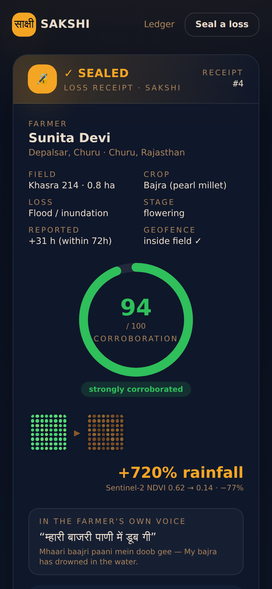
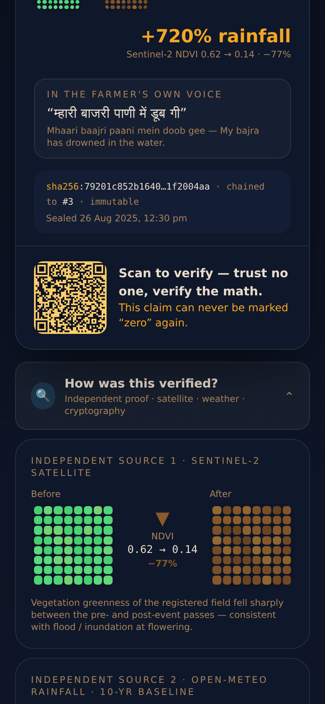
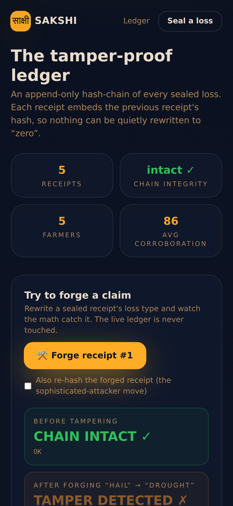

<div align="center">

# SAKSHI · साक्षी

### The tamper-proof witness to every farmer's crop loss — sealed in 10 seconds, in their own language, before anyone can mark it "zero."

**AI for Bharat 2026 · Build Round**
PRIMARY AgriTech · SECONDARY Financial Inclusion · ACCESS LAYER Regional-Language AI

</div>

---

## The problem

In Churu, Rajasthan, Sunita Devi loses 60% of her bajra to a freak flood. She
calls the helpline, photographs the field on WhatsApp, and waits. Months later
the insurer's report reads **"loss: zero."** No surveyor ever came. Her story is
one of **1.7 lakh farmers zeroed out in a single ₹122-crore PMFBY scam** in one
state — forged loss reports, no field survey, farmers never even told.

The open secret: **the person who verifies the loss is paid to minimise it.**

## The paradigm shift

Stop asking the insurer to *prove* the loss. **Let the farmer *seal* it** — the
instant it happens, in their own voice, corroborated by two sources no one can
bribe: **free satellite + weather data**. SAKSHI turns crop-loss evidence from a
discretionary survey owned by the payer into a **tamper-evident receipt owned by
the farmer**.

> **The moat is VERIFICATION + INTEGRATION:** remove every LLM and the seal, the
> hash-chain, and the corroboration still stand.

---

## ▶ The 10-second Moment

A farmer speaks one sentence in Marwari — *"म्हारी बाजरी पाणी में डूब गी"* (my bajra
has drowned). The screen flashes her field's satellite chart going **green→brown**,
a **+720% rainfall** stamp, and a glowing **✓ SEALED · Corroboration 94/100**
receipt with a cryptographic hash chained to the previous one.

**This claim can never be marked "zero" again.**

| The seal (Screenshot Moment) | The proof, revealed | Try to forge it |
|---|---|---|
|  |  |  |

---

## The two deterministic "gravity" components (the technical moat)

Both are pure, framework-free TypeScript with **49 passing tests**. No AI, no
network — just interesting, auditable computer science.

### 1 · Tamper-evident evidence pipeline — `src/core/hashchain.ts` + `geofence.ts`
EXIF/GPS → point-in-polygon **geofence** against the registered field polygon →
canonical **SHA-256** → **append-only hash-chain** (each receipt embeds the
previous receipt's hash) → deterministic `verifyChain()`.

Editing, deleting, reordering **or even re-hashing** a receipt breaks the chain
and is mathematically detectable. The `/ledger` page lets anyone try it live.

### 2 · Multi-signal corroboration engine — `src/core/corroboration.ts`
Fuses three independent, un-bribable signals into a **0–100 score with
machine-readable reasons**:

- **Sentinel-2 NDVI collapse**, interpreted against the crop's **growth stage**.
- **Weather anomaly** as a **Z-score vs a 10-year baseline** — in the direction
  the loss predicts (excess rain for floods, deficit for drought, heat for
  heatwaves).
- **PMFBY 72-hour** reporting window.
- plus a **cross-signal integration term** that rewards independent sources
  agreeing — the heart of VERIFICATION + INTEGRATION.

The flagship Churu flood scores **94/100** from **real 2025 Open-Meteo data**.

---

## The data is real (the Real Architecture Rule)

**architecture REAL · data SEEDED · scale SIMULATED. Computation is never faked.**

The five seeded 2025 Churu-district events use **real field coordinates** and
**real Open-Meteo ERA5 weather**. The provenance script reproduces the exact
committed numbers:

```bash
node scripts/fetch-weather.mjs
# event-churu-flood-2025   rain observed=58.2mm baseline=7.1mm z=5.89 anomaly=721%
# event-rajgarh-flashflood rain observed=72.4mm baseline=7.2mm z=10.71 anomaly=907%
# ...
```

| Farmer | Place | Loss | Corroboration |
|---|---|---|---|
| Sunita Devi | Churu | Flood (bajra) | **94** |
| Bhanwari Devi | Rajgarh | Flash flood (bajra) | 92 |
| Ramlal Jat | Sardarshahar | Waterlogging (guar) | 85 |
| Sita Devi | Ratangarh | Hailstorm (moong) | 83 |
| Mohan Lal | Taranagar | Heatwave (fodder) | 77 |

---

## Keyless by design

**The demo depends on zero secrets you can't set.** With no API keys and no
database, the deployed app is fully functional on seeded data and the
deterministic core — it even works on airplane mode. Live integrations are
progressive enhancement behind clean adapters that **fail closed** to seed:

- **Open-Meteo** weather — free, no key (live path enabled).
- **Copernicus / Sentinel-2** NDVI — key-gated → seeded NDVI.
- **Bhashini** STT/TTS/translate — key-gated → seeded translations.
- **Supabase** persistence — optional → in-memory seed store (`supabase/schema.sql`).

---

## Run locally

```bash
npm install
npm run dev            # http://localhost:3000
npm test               # 49 Gravity Core + store tests
npm run verify         # build + browser smoke-test of the golden path
```

No `.env` needed. Optional keys are documented in `.env.example`.

## Deploy

One-click on **Vercel**: import this repo, keep the auto-detected **Next.js**
preset, and deploy. **No environment variables are required** — the keyless demo
runs on seeded data + free Open-Meteo. For durable persistence, create a Supabase
project, run `supabase/schema.sql`, and set the three `NEXT_PUBLIC_SUPABASE_*` /
`SUPABASE_SERVICE_ROLE_KEY` variables (see `.env.example`).

## Architecture

```
Voice + photo
   │  EXIF/GPS  ──▶  geofence (point-in-polygon)  ──▶  SHA-256  ──▶  append-only hash-chain
   │                                                                        │
   └─▶ Sentinel-2 NDVI ─┐                                                   ▼
       Open-Meteo Z-score ├─▶ corroboration engine ─▶ 0–100 + reasons ─▶ SEALED Loss Receipt
       72-hour window   ─┘                                                  │  QR verify · multilingual
                                                                            ▼
                                                        farmers · fields · loss_events · evidence_receipts
                                                        · corroboration_reports · claim_dossiers · audit_log
```

- **Golden path:** `/seal` → capture → speak → SEALED → `/receipt/[hash]`
- **Appeal dossier:** `/dossier/[hash]` — print to PDF or export machine-readable JSON for the DGRC/ombudsman.
- **Public verifier:** `/verify/[hash]` (the QR target) — recomputes every hash.
- **The moat, on display:** `/ledger` — the live chain, audit log, tamper demo.
- **Liveness:** `/health`.

## Routes

| Route | What |
|---|---|
| `/` | The hook + live ledger stats + the five real events |
| `/seal?event=…` | The three-tap golden path (the Moment) |
| `/receipt/[hash]` | The Loss Receipt (Screenshot Moment) + "How was this verified?" |
| `/dossier/[hash]` | Appeal-ready, multilingual, print-perfect Loss Dossier (DGRC/ombudsman) |
| `/verify/[hash]` | Public QR verifier — trust no one, verify the math |
| `/ledger` | Hash-chain, append-only audit log, live tamper demo |
| `/health`, `/api/seal`, `/api/events`, `/api/tamper`, `/api/dossier/[hash]` | Server endpoints |

## Tech stack

Next.js 14 (App Router) · TypeScript · Tailwind CSS · Framer Motion · Node
`crypto` (SHA-256) · `exifr` · `qrcode` · Vitest + Playwright. Optional: Supabase
(Postgres + RLS). APIs: Open-Meteo (keyless), Copernicus/Sentinel-2, Bhashini.

## License

MIT — original code, written during the AI for Bharat 2026 build window.
